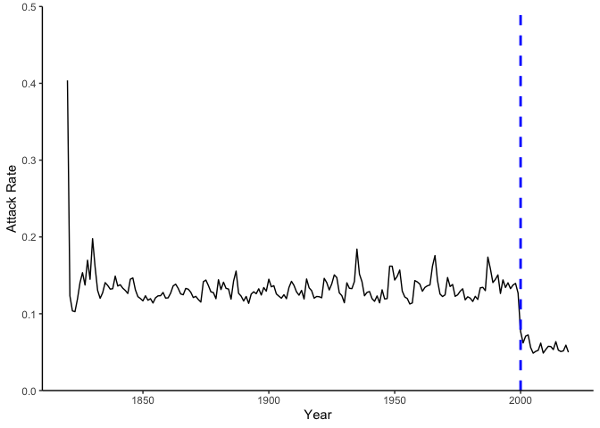

<!-- README.md is generated from README.Rmd. Please edit that file -->

# MOdelling REpeat VACcination (morevac)

<!-- badges: start -->
<!-- badges: end -->

## Overview

To model the effects of repeated exposures to infectious diseases (e.g.,
infection and vaccination) over an individual’s lifetime, we developed a
multi-annual, individual-based, stochastic model of infection and
vaccination. This model and the associated functions comprise the
`morevac` package. Our model incorporates three main components: 1.
viral evolution, specifically antigenic drift of the infecting virus
over time, 2. vaccine kinetics influencing the amount of protection
conferred by the vaccine, namely antigenic match of the circulating
strain and vaccine strain, waning, and take (defined as the proportion
of individuals who receive the vaccine and have an immune response), and
3. individual level characteristics, such as age and prior exposure
history. All three components are then used to inform an individual’s
susceptibility to infection at each time point (here, considered to be
one year). The full model and assumptions are described by [Ainslie and
Riley 2022](https://doi.org/10.1016/j.vaccine.2022.03.065).

<figure>

<figcaption aria-hidden="true">Figure 1. Model schematic of A) antigenic
drift and vaccine update and B) individual susceptibility over time
depending on exposure history. Colored regions in A represent the years
in which a vaccine was used. The color change indicates that the vaccine
was updated. The vertical red lines in B indicate an infections and the
dashed vertical lines indicate vaccinations. Note the color of the
vaccine lines in B match those in A indicating the match between the
vaccine strain and cirulating virus and the impact of match or mismatch
on susceptibility (black line in B).</figcaption>
</figure>

## Installation

1.  Install [R](http://cran.r-project.org)

2.  Install the development version of serosolver from
    [GitHub](https://github.com/seroanalytics/serosolver):

``` r
devtools::install_github("kylieainslie/morevac")
library(morevac)
```

## Example

``` r
# load required packages
library(morevac)
library(rdist)
library(dplyr)
library(tidyr)
library(stringr)
library(ggplot2)
```

The function `mutiannual` initialises the population and then simulates
infections and vaccinations over years within the population. By
default, the model runs from 1820 to 2019 with a vaccination starting in
2000 with an assumed coverage of 50%. These assumptions can be changed
using the arguments in `multiannual`.

``` r
# run multi-annual model
out <- multiannual()
```

The output produced by `multiannual` is a named list that contains the
following elements:

- `inf_history`: a named list of elements related to the infection
  histories of each individual, including
  - `inf_hist_mat`: a matrix of infection histories, where each row
    represents each individual and columns represent years. A value of 1
    in inf_hist_mat\[1,j\] indicates that person i had an infection in
    year j.
  - `suscept_mat`: a matrix that contains an individuals susceptibility
    to infection over time. Values range from 0 (completely immune) to 1
    (completely susceptible).
- `vac_history`: a named list of elements related to the vaccination
  histories of each individual, including
  - `n`: number of individuals
  - `vac_hist_mat`: a matrix of vaccination histories, where each row
    represents each individual and columns represent years. A value of 1
    in vac_hist_mat\[1,j\] indicates that person i was vaccinated in
    year j.
  - `v`: a matrix of the number of years since last vaccination. If
    never vaccinated the value of v = 999 and then increases each year
    until vaccination occurs. In the year that an individual was
    vaccinated v = 0.
- `ages`: matrix of each individual’s age over time. We assume that an
  individual dies at age 80 and is then replaced by another person aged
  0.
- `drift`: a named list of elements related to viral atigenic drift over
  time with the following elements:
  - `drift`: a data frame with the cumulative amount of drift (drawn
    from an exponential distribution with rate specified by the user)
    over time. The data frame has two columns: `x` represents the year
    and `y` represents the cumulative drift from the first year.
  - `antigenic_dist` a matrix with the antigenic distance over time as
    calculated by `pdist`.
- `vac_update`: an identity vector indicating in which years the vaccine
  formula should be updated (1 = yes, 0 = no).
- `gammas`: a vector of the protection conferred by vaccination. In
  years in which the vaccine formula is a perfect match to the virus
  strain, then gamma = 0.3. In years in which the vaccination is not a
  perfect match, the reduction in protection declines until the vaccine
  strain is updated again.
- `vac_this_year`: an identity vector indicating in which years
  vaccination should occur (1 = yes, 0 = no). Most of the outputs
  produced by out or for housekeeping within the model and may not be
  relevant for the user.

<!-- -->

    #> List of 7
    #>  $ inf_history  :List of 5
    #>   ..$ inf_hist_mat : num [1:10000, 1:200] 1 1 0 0 0 0 1 0 1 0 ...
    #>   ..$ suscept_mat  : num [1:10000, 1:200] 0 0 1 1 1 1 0 1 0 1 ...
    #>   ..$ x            : num [1:10000, 1:200] 0 0 999 999 999 999 0 999 0 999 ...
    #>   ..$ delta_x      : num [1:10000, 1:200] 0 0 999 999 999 999 0 999 0 999 ...
    #>   ..$ num_exposures: num [1:10000] 21 23 25 24 23 30 21 20 26 25 ...
    #>  $ vac_history  :List of 3
    #>   ..$ n           : int 10000
    #>   ..$ vac_hist_mat: num [1:10000, 1:200] 0 0 0 0 0 0 0 0 0 0 ...
    #>   ..$ v           : num [1:10000, 1:200] 999 999 999 999 999 999 999 999 999 999 ...
    #>  $ ages         : num [1:10000, 1:200] 72 71 19 11 2 27 62 18 5 79 ...
    #>  $ drift        :List of 2
    #>   ..$ drift         :'data.frame':   200 obs. of  2 variables:
    #>   .. ..$ x: int [1:200] 1 2 3 4 5 6 7 8 9 10 ...
    #>   .. ..$ y: num [1:200] 1.06 1.57 2 2.82 3.42 ...
    #>   ..$ antigenic_dist: num [1:200, 1:200] 0 1.12 2.21 3.48 4.64 ...
    #>  $ vac_update   : int [1:200] 1 0 0 0 0 1 0 0 1 0 ...
    #>  $ gammas       : num [1:200] 0.3 0.302 0.308 0.341 0.455 ...
    #>  $ vac_this_year: num [1:200] 0 0 0 0 0 0 0 0 0 0 ...

Using the output from `multiannual`, we can look at some of the model
components graphically. For example, we can look at the attack rate over
time using `plot_attack_rates` and using `out$inf_history$inf_hist_mat`
as input. Note: the vaccination campaign begins in 2000.

``` r
# get attack rates
ar_out <- get_attack_rates(inf_history = out$inf_history$inf_hist_mat,
                           ages_mat = out$ages, years = 1820:2019)
# plot total attack rates
p_ar <- plot_attack_rates(dat = ar_out$attack_rates)
p_ar + geom_vline(xintercept = 2000, linetype = "dashed", color = "blue", linewidth = 1)
```

<div class="figure">


<p class="caption">
Figure 1. Attack rates in the modelled population over time. The blue
dashed line indicates the start of the vaccination program with an
assumed coverage of 50%.
</p>

</div>
